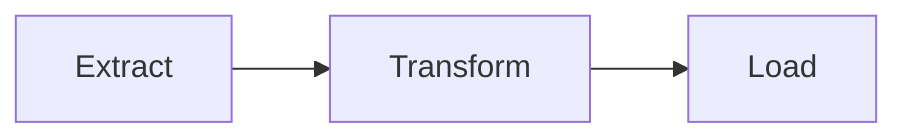

# Estrutura do projeto

```text
Data-Project-Starter-Kit/
├── app/                # todo o código do projeto vive aqui
│   ├── main.py         # ponto de entrada: orquestra o pipeline
│   └── pipeline/        # extract / transform / load
├── tests/              # testes automatizados (pytest), espelhando app/
├── docs/                # este site (MkDocs Material + mkdocstrings)
├── data/                # dados de exemplo — input/ e output/, gitignored
├── .github/             # workflow de CI e template de Pull Request
├── .python-version     # versão do Python travada (uv)
├── pyproject.toml      # dependências, Ruff, pytest, taskipy
├── uv.lock             # lock de dependências (reprodutibilidade)
├── .pre-commit-config.yaml
└── mkdocs.yml
```

## A regra de ouro

Código fica dentro de `app/`. Não importa se o projeto vira um ETL, uma API,
um dashboard ou um pipeline de ML — a lógica sempre mora ali dentro. As
pastas `tests/`, `docs/` e `data/` são universais e não mudam de nome
conforme o tipo de projeto.

## Sobre `data/`

Em produção, dados raramente ficam versionados no repositório — eles vêm de
um data lake, S3, banco de dados, etc. `data/input/` e `data/output/` servem
apenas para exemplos e testes locais e estão no `.gitignore` (os `.gitkeep`
existem só para a pasta não sumir do Git quando estiver vazia).

## Fluxo do pipeline



Cada etapa é um módulo isolado em `app/pipeline/`, com responsabilidade
única — veja [Pipeline](pipeline.md) para a documentação gerada a partir do
código.
