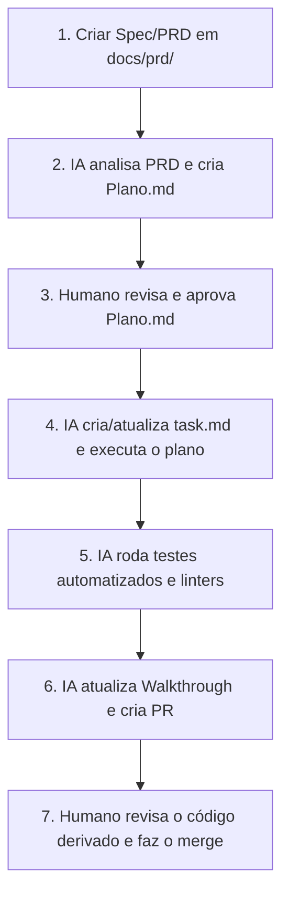

# SDD na Prática: Desenvolvimento Orientado a Especificações

## O que é SDD?

O **SDD (Spec-Driven Development / Desenvolvimento Orientado a Especificações)** é uma metodologia de desenvolvimento de software em que todo o ciclo de implementação é guiado por documentos de especificação claros, planos estruturados e convenções rígidas, tratando o código-fonte como uma **saída derivada** desse processo.

No contexto de desenvolvimento acelerado por Inteligência Artificial (como Cursor, Claude Code, Windsurf, etc.), o SDD deixa de ser apenas uma recomendação de governança e passa a ser uma **necessidade técnica**. O SDD garante que:
1. **Redução de Alucinações:** A IA tem limites rígidos de escopo e definições explícitas de comportamento.
2. **Previsibilidade:** O design e a arquitetura são acordados e revisados por humanos antes de qualquer linha de código ser gerada.
3. **Eficiência de Contexto:** Menor desperdício de tokens, pois o agente sabe exatamente quais arquivos ler e modificar.
4. **Alinhamento Contínuo:** As decisões de engenharia são documentadas formalmente, evitando desvios ou refatorações desnecessárias.

---

## Mapeamento de Conceitos: Padrão Spec Kit vs. Convenções do Projeto

Abaixo apresentamos o mapeamento dos conceitos gerais do SDD para a estrutura física implementada neste template de projeto.

| Conceito SDD | Padrão Spec Kit (Abstrato) | Mapeado nas Convenções deste Projeto | Objetivo / Utilidade Prática |
| :--- | :--- | :--- | :--- |
| **Constitution (Regras Globais)** | `.specify/memory/constitution.md` | [`CLAUDE.md`](file:///c:/Users/Filipi/Documents/workspace/Data-Project-Starter-Kit/CLAUDE.md) e `.agents/AGENTS.md` | Define diretrizes de estilo, padrões de commit, comandos aceitos e regras que o agente de IA deve seguir em toda sessão. |
| **Feature Spec (O Quê & Porquê)** | `specs/<feature>/spec.md` | `docs/prd/` (baseado no [`PRD_TEMPLATE.md`](file:///c:/Users/Filipi/Documents/workspace/Data-Project-Starter-Kit/PRD_TEMPLATE.md)) | Descreve as regras de negócio, requisitos funcionais e o que está **fora de escopo** para a feature. |
| **Implementation Plan (Como)** | `specs/<feature>/plan.md` | `Plano.md` ou `implementation_plan.md` | Esboço técnico de arquivos a modificar, assinaturas de funções e estratégias de validação a serem aprovadas antes de codificar. |
| **Tasks & Checklists** | `specs/<feature>/tasks.md` | `task.md` (no diretório do agente) ou checklist de PRD | Lista de tarefas (TODO list) que o agente atualiza de forma viva durante a execução. |
| **Custom Agent Skills** | `.specify/scripts/` / `templates/` | [`.agents/skills/`](file:///c:/Users/Filipi/Documents/workspace/Data-Project-Starter-Kit/.agents) | Guias operacionais específicos para ensinar o agente a utilizar ferramentas ou workflows complexos. |
| **Decisões Arquiteturais** | N/A | `decisoes/` ou `docs/adr/` | Registros de Decisão de Arquitetura (ADRs) para evitar o desvio de design do sistema ao longo do tempo. |
| **Código Derivado** | `src/` | `app/` | O código-fonte gerado a partir da especificação técnica aprovada. |

---

## Como Utilizar os Documentos e Templates na Prática

### 1. A Constituição Global: `CLAUDE.md`
O arquivo `CLAUDE.md` serve como a memória de longo prazo do repositório para o agente de IA.
- **Por que é útil:** Ele evita que você precise explicar em todo prompt coisas como: "use pytest", "use Ruff", "formate com Ruff", ou "não faça commit na main". O agente lê este arquivo automaticamente ao iniciar a sessão.
- **Como manter:** Se você mudar de biblioteca de testes (ex: de pytest para unittest) ou adotar um novo padrão de código, **atualize o `CLAUDE.md` imediatamente**. Ele deve refletir a verdade atual do projeto.

### 2. Especificação por Feature: `PRD_TEMPLATE.md`
Para qualquer tarefa que não seja uma correção trivial de bug, você deve iniciar criando uma especificação de PRD.
- **Passo a passo prático:**
  1. Copie o template da raiz: `cp PRD_TEMPLATE.md docs/prd/001-minha-feature.md`
  2. Preencha os requisitos funcionais, entradas e saídas esperadas.
  3. **Crucial:** Defina o que está **Fora de Escopo** para evitar que a IA gaste tempo (e tokens) adicionando recursos especulativos.
  4. Referencie o arquivo no seu prompt inicial para a IA:
     > *"Leia a especificação em `docs/prd/001-minha-feature.md` e elabore o plano de implementação."*

### 3. O Plano de Implementação: `Plano.md`
O plano é a ponte entre a especificação de negócio (PRD) e o código final. Ele descreve quais arquivos serão modificados/criados e como serão testados.
- **Boas Práticas:**
  - O agente deve gerar este plano em um arquivo separado (ex: `Plano.md` ou `implementation_plan.md`).
  - **Apenas prossiga após a sua revisão e aprovação explícita** do plano. Isso economiza tempo e evita código mal projetado.

### 4. Automações e Procedimentos: Biblioteca de Skills (`.agents/skills/`)
As skills ensinam o agente a realizar tarefas complexas ou usar ferramentas específicas do seu ecossistema.
- **Quando usar:** Se você possui um workflow recorrente (ex: deploy no GCP, sincronização com dbt, geração de schemas de banco), crie uma skill para que a IA execute esse fluxo sempre no mesmo padrão de qualidade.

---

## Ciclo de Desenvolvimento SDD Passo a Passo

O fluxo ideal de engenharia para criar uma nova funcionalidade no projeto segue o ciclo abaixo:

### Exemplo Prático de Prompt de Inicialização
Para iniciar uma nova funcionalidade seguindo este ciclo, envie o seguinte prompt ao agente de IA:

> "Gostaria de criar a funcionalidade de exportação de relatórios conforme a especificação em `docs/prd/002-export-reports.md`. Por favor, analise as regras de negócio e a arquitetura do repositório, consulte o `CLAUDE.md` e gere o plano de implementação em `Plano.md` para minha revisão antes de escrever qualquer código."
